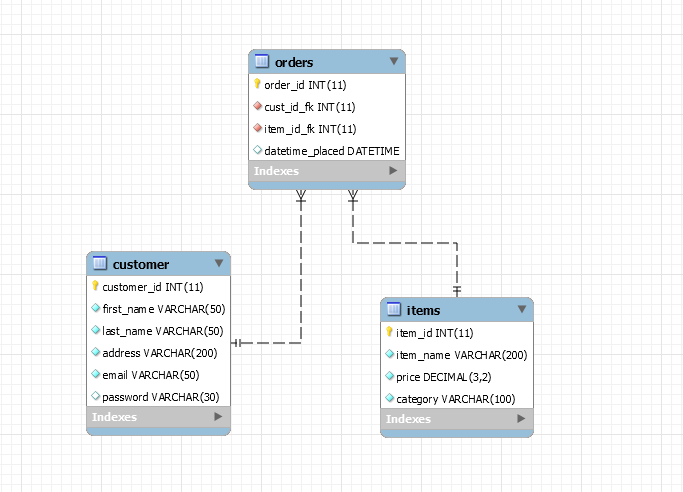
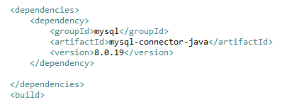

# QA Project 1 #
## Inventory Management  - Shani McDonald ##

### Inventory Management system

#### Objective
    - Create an application using Java that interacts with a managed SQL database.

Tools used:
- Java
    - JDBC (Java Database Connectivity)
- Maven
- My SQL
- Google Cloud Platform
- Git/Git bash
- JIRA

# Set up:

## Cloud 
I started by selecting a cloud computing service to be able to host my database online. 
I picked Google Cloud platform. 
I navigated to SQL in the GCP console menu and created an instance. 

Choices made:
For connectivity, I enabled Public IP and entered *0.0.0.0/0* as an allowed network because this allows all iPv4 IP addresses to be able to access the instance.

I chose the Europe-West-2 as my region as this includes London where I reside. 

Machine type:
I chose db-g1-small with a 1.7GB memory which provides less storage space than the db-n1 standard type of 3.75GB but as this project is for demonstration/testing, I found a smaller memory allowance of 1.7GB to suffice, however I did enable automatic storage increase in case that changes.

## Connecting to the database:
The IDE used for creating my schemas and tables was *MySQL Workbench*.  
I used the public IP address from my GCP SQL instance to connect when prompted during the *add database* procedure.

# SQL Schema design

## One to many:
Customer to order schemas
- A customer can have many orders but an order can only be unique to the customer that placed it.

Items to Order Schemas
- An order can contain many items

# Java
Using the IDE, Eclipse, I created a *Maven* project so that a directory for the following can be included:
- Testing
- Source code
- Resources
- The POM.xml for managing packages.

## JDBC
Task: Define how my database connects with Java.
I sourced the package named jdbc from the Maven online repository and copied into my POM.xml file as follows:

Once in place, I was able to create a Java class that would contain the information required for my new imported package to read for connectivity: 
I created the following variables: 
- JDBC_DRIVER
- DB_URL
- USER
- For the sake of development I hard coded my username and password although this wouldn't be best practice for a deployed application.

## Creating the tables in Java

